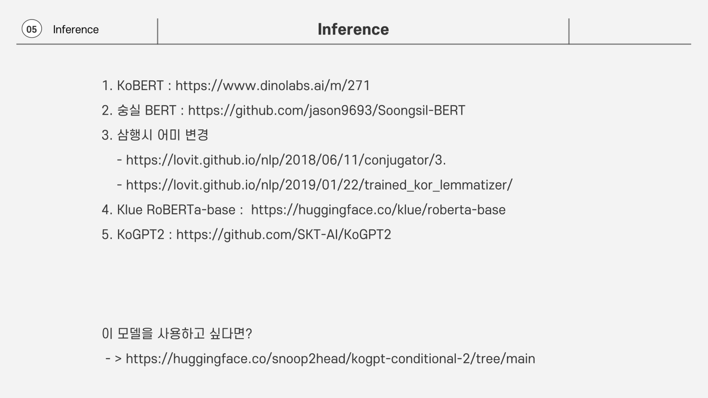

# 🌽 작물의 생산성과 유통 용이성 기반의 귀농 최적 지역 추천 지수 개발

.png>).png>).png>).png>).png>).png>).png>).png>).png>).png>).png>).png>).png>).png>).png>).png>).png>).png>).png>).png>).png>).png>).png>).png>).png>).png>).png>).png>).png>).png>).png>).png>)
